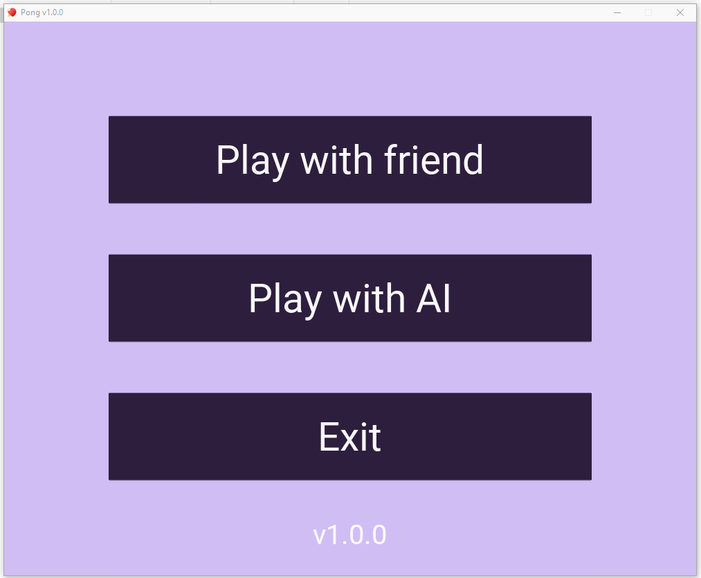

# pong
Игра **pong**, написанная на Python c использованием kivy.

## Запуск

1. Перейдите в папку **scripts** и выполните скрипт:

   - **install.bat**, если вы работаете в *Windows*;

   - **install.sh**, если вы работаете в *Linux*:

     ```bash
     bash install.sh
     ```

2. Из той же папки **scripts** выполните скрипт:

   - **run.bat**, если вы работаете в *Windows*;

   - **run.sh**, если вы работаете в *Linux*:

     ```bash
     bash run.sh
     ```

## Выпуск релиза на Windows и Linux

1. Перейдите в папку **scripts** и выполните скрипт:

   - **install.bat**, если вы работаете в *Windows*;

   - **install.sh**, если вы работаете в *Linux*:

     ```bash
     bash install.sh
     ```

2. Из той же папки **scripts** выполните скрипт:

   - **release.bat**, если вы работаете в *Windows*;

   - **release.sh**, если вы работаете в *Linux*:

     ```bash
     bash release.sh
     ```

## Выпуск релиза для Android

1. Установите утилиту buildozer. Инструкция по установке [здесь](https://buildozer.readthedocs.io/en/latest/installation.html).

2. Перейдите в терминале в корень репозитория и выполните команду:

   ```bash
   buildozer -v android release
   ```

3. Чтобы создать apk-файл, выполните команду:

   ```bash
   buildozer -v android debug
   ```

## Возможные ошибки

1. На *Ubuntu 20* может не работать звук. Тогда нужно:

   - установить все необходимые зависимости для kivy:

     ```bash
     sudo apt-get update
     sudo apt-get install python3-pip build-essential git python3 python3-dev ffmpeg libsdl2-dev libsdl2-image-dev libsdl2-mixer-dev libsdl2-ttf-dev libportmidi-dev libswscale-dev libavformat-dev libavcodec-dev zlib1g-dev
     ```

   - в терминале перейти в корневую папку репозитория и выполнить команды:

     ```bash
     venv/bin/python -m pip uninstall kivy
     venv/bin/python -m pip install --no-binary kivy kivy
     ```

## Пример работы



## Примечание

Приложение проверялось на:

- *Windows 10 64-bit* с Python 3.6.8;
- *Ubuntu 20* с Python 3.8.10.
